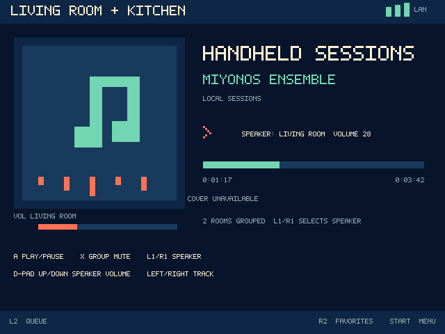

# Miyonos

Miyonos turns a Miyoo Mini Plus running OnionOS into a fast, button-first,
local Sonos remote. It uses the speakers' LAN UPnP/SOAP interface: there is no
Miyonos account, cloud service, API key, analytics, or advertising. It makes
no internet request by default; an owner can separately opt in to verified
external cover downloads.



Version 0.1.24 is a technical preview with real Sonos LAN validation, robust
source-provided cover retrieval, a local Miyoo battery gauge, a local
simulator, and sharp native 640 × 480 output through the device's
double-buffered framebuffer. It includes:

- SSDP multicast and broadcast discovery, cached-address fallback, and a
  D-pad-operated manual IPv4 editor;
- topology-aware logical rooms, groups, coordinators, bonded-player filtering,
  room joining, and room removal;
- play/pause, previous/next, individual speaker volume within a group, group
  mute, seeking, live progress, track metadata, current saved-playlist name,
  and real source-provided cover artwork with a bounded on-card cache; and
- the Miyoo's own battery percentage on Now Playing, read locally from its
  hardware fuel gauge without network access;
- editable mappings for every physical button, protected by a lockout check
  and a fixed hardware recovery chord;
- paged Queue browsing that shows the current Sonos saved playlist when one is
  playing, plus selected-cover views for Saved Playlists and Sonos Favorites,
  and Favorites playback;
- an optional **External cover art over HTTPS** switch. It is off by default
  and accepts only verified public Spotify and Sonos Radio/TuneIn cover URLs;
  it never sends a Sonos login, cookies, playback data, or device identifiers;
- offline recovery, bounded retries, confirmations, rotating logs, settings,
  diagnostics, help, and a polished 640 × 480 interface;
- a self-contained OnionOS package and a double-clickable macOS simulator with
  safe built-in Sonos scenarios and an optional Live Sonos mode.

The desktop/mock suite and ARM cross-build pass. Discovery, playback metadata,
cover retrieval, topology, and an idempotent volume write have also been
validated against a real mixed-model Sonos household. Version 0.1.24 accepts
the strict Spotify, Spotify-in-Sonos, and Sonos Radio/TuneIn cover endpoint
forms that real Sonos Favorites expose. A direct radio Favorite waits for its
buffering transition to settle, recognizes Sonos' rewritten session flags, and
uses the current approved Sonos Radio logo proxy. Its physical Miyoo visual
smoke test remains in progress. See
[docs/FINAL_STATUS.md](docs/FINAL_STATUS.md) for the exact verification boundary.

## Requirements

- Miyoo Mini Plus
- OnionOS 4.3.x; the release is built against assumptions verified for
  OnionOS 4.3.1-1
- Miyoo and Sonos products on the same IPv4 LAN
- Internet access only if **Settings → External cover art over HTTPS** is enabled

The Sonos local interface is unofficial. Models, sources, and firmware can
expose different capabilities, so unsupported actions fail safely and leave
the remote usable.

## Continue this project in a new chat

Start with [docs/PROJECT_HANDOFF.md](docs/PROJECT_HANDOFF.md). It records the
current release, physical-device state, recommended update route, test order,
project map, and known verification boundary so this repository can be handed
to another maintainer without relying on prior conversation context.

## Install

1. Download `Miyonos-0.1.24-OnionOS.zip` and shut down the Miyoo.
2. Put the OnionOS SD card in a computer.
3. Extract the ZIP onto the **root** of the card. The resulting file must be
   `App/Miyonos/config.json`, not a second nested Miyonos folder.
4. Safely eject the card, boot the Miyoo, and open **Apps → Miyonos**.

Settings, artwork, and logs are stored in `App/Miyonos/data`. Installing a
new release over the app leaves that directory alone. SSH deployment is
documented in [docs/WIFI_INSTALL.md](docs/WIFI_INSTALL.md).

For the recommended installation on Windows, macOS, or Linux, unzip
`Miyonos-0.1.24-Universal-Browser-Installer.zip` and double-click
`Open Miyonos Installer.html`. The guide uses OnionOS's built-in HTTP file
server, so nothing is installed on the computer. It walks through enabling the
service, opening the Miyoo from a browser, and uploading the included
`Miyonos` folder into `App`.

See [docs/UNIVERSAL_INSTALL.md](docs/UNIVERSAL_INSTALL.md) for the universal
browser flow. The atomic SSH alternative for a first install or later update
is:

```sh
./dist/Miyonos-wifi-install.sh MIYOO_IP_ADDRESS
```

Keep the updater, release ZIP, and `.sha256` file together. The updater checks
the release, preserves all user data, switches versions safely, and retains a
rollback copy. It can also be run as `./scripts/wifi-install.sh` from a source
checkout. See [docs/WIFI_INSTALL.md](docs/WIFI_INSTALL.md) for this advanced
method.

## Essential controls

On the Now Playing screen: A plays/pauses; L1/R1 selects a speaker in the
current group; Up/Down changes that speaker's volume; Left/Right change track;
X toggles group mute; Y opens Rooms & Groups;
L2 opens Queue; R2 opens Favorites; Start opens the menu; Select refreshes;
Menu asks to exit. B goes back. Every button can be changed in **Settings →
Button mapping**. Holding Menu + Start for three seconds always restores the
default layout.

In Queue, X switches to **Saved Playlists**. That view shows the selected
playlist's source-provided cover art. Press A to play it; Miyonos replaces the
current Sonos queue first, so the selected playlist begins at its first track.
Favorites also shows the selected favorite's source-provided cover art, or
**Cover unavailable** when the Sonos item does not provide one. L1/R1 cycles
the group-volume target together with each individual speaker.

Spotify Favorites and Sonos Radio stations can provide a public HTTPS cover
instead of a local Sonos image. To show those covers, turn on
**Settings → External cover art over HTTPS**. The switch is optional and off
by default. It permits a fixed allowlist of strict Spotify and Sonos
Radio/TuneIn cover URLs with certificate and hostname verification against the
bundled offline trust roots. Radio artwork may use one fixed, verified redirect
from a Sonos proxy to a TuneIn image CDN; no Sonos or music-service credentials
are used.

See [docs/CONTROLS.md](docs/CONTROLS.md) for all screens and desktop keys.

## Develop without the physical Miyoo

Double-click `dist/Miyonos Simulator.app` and choose a safe scenario or the
explicitly confirmed Live Sonos mode. The chooser provides single-room,
multi-room, grouped, long-queue, missing-artwork, slow, offline, and
coordinator-change coverage without a terminal. Developers can also start a
specific scenario directly:

```sh
./scripts/run-simulator.sh --scenario grouped
./scripts/run-simulator.sh --scenario offline
./scripts/run-simulator.sh --live-sonos
```

The simulator draws the real app into its exact 640 × 480 software frame and
places that frame inside a clickable Miyoo Mini Plus. Mouse, keyboard, and SDL
game controllers all produce the same semantic actions as the physical keys.
The safe fixtures are native and bundled; they require no Python process and
never search for or control real speakers. Their code-generated cover verifies
the complete artwork presentation path. `--live-sonos` is the only mode that
uses the local Sonos network, and the double-click chooser requires a separate
warning confirmation before starting it.

Simulator settings, logs, and artwork use a reconstructed SD-card tree below
`~/Library/Application Support/Miyonos Simulator`; they never share the
physical card's data. Use `--screen-only` for pixel-exact captures and tests.

## Build and test

```sh
./scripts/run-simulator.sh
./scripts/build-simulator-app.sh
./scripts/test-all.sh
```

The target build uses Docker with an explicit `linux/amd64` builder, verifies
the pinned Miyoo toolchain archive, builds a Cortex-A7 ARM hard-float binary,
retains debug symbols separately, and produces the OnionOS ZIP and SHA-256
file. Full prerequisites are in [docs/BUILDING.md](docs/BUILDING.md).

If Miyonos finds no rooms, confirm the Miyoo and speakers are on the same
non-guest LAN, then use **Settings → Manual player IP**. Logs are at
`App/Miyonos/data/logs`. More help is in
[docs/TROUBLESHOOTING.md](docs/TROUBLESHOOTING.md).

Miyonos is an independent community project and is not affiliated with or
endorsed by Sonos, Inc. or the OnionOS project.

Released under the [MIT License](LICENSE). Bundled SDL components retain their
own license in `third_party/licenses`.
